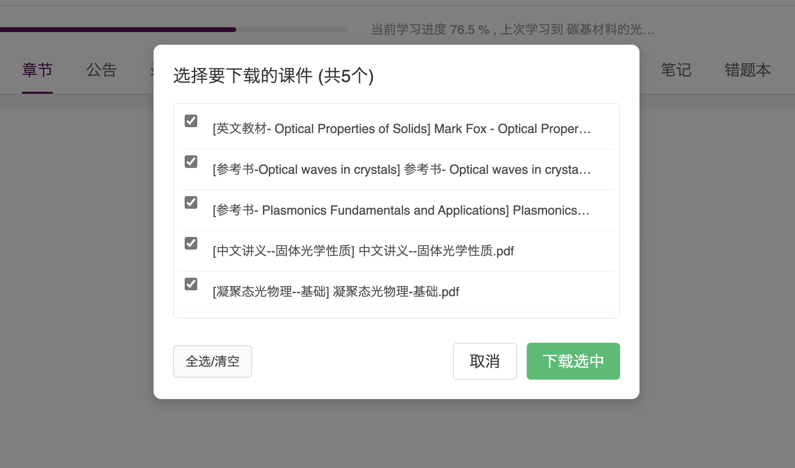
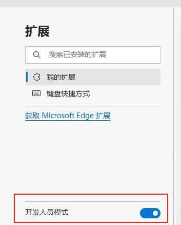

# 南大LMS智慧教育平台|MOOC增强

请使用篡改猴|油猴插件 Tampermonkey 来进行安装

最新功能 v 0.51：重构 LMS 原生播放、后台恢复和章节切换逻辑；页面加载设置后始终启用视频辅助；仅保留 LMS 原生进度请求，不再拦截进度接口或生成虚拟观看请求；统一认证支持延时自动登录及拼图滑块处理，并补充 0.5x、1.5x、2x 倍速。

近期更新历史 
- v 0.51：合并原 0.50 更新；重构原生播放与后台恢复，强制启用 LMS 视频辅助，移除进度接口拦截和虚拟观看请求，并完善统一认证登录与倍速选项。
- v 0.40：解除课件下载限制，支持选择下载，并增加视频辅助总开关。
- v 0.30：增加课件自动下载和早期登录辅助。
## 功能简介
1. ▶️通过播放器原生按钮自动播放，并验证播放时间真实推进
2. 🖥️窗口失焦、页面隐藏或鼠标离开播放器时保护后台播放
3. ⏩侧边菜单提供 0.1x/0.5x/1x/1.5x/2x/3x/16x 多档倍速
4. ⏭️视频结束后等待 LMS 提交最终进度，再自动进入下一节
5. 🧭支持单页章节切换、同源 iframe 和 Shadow DOM 播放器
6. 🔐统一认证页面支持本地保存账号密码、设置提交延时并自动完成拼图滑块
7. ⏬解除下载限制，可选择下载所有课件资料

## 使用演示
刷课相关功能请按下图从右侧菜单选择所需倍速。“开启视频辅助功能”默认开启，可在设置中随时关闭。

课件下载功能

## 一键安装教程

### 第一步
**请先安装 [Tampermonkey](https://www.tampermonkey.net/) 浏览器扩展**

各浏览器具体链接：

### 第二步
第一次安装需要打开浏览器的开发者模式。

Edge浏览器: 地址栏输入edge://extensions/并回车，打开开发人员模式

Chrome浏览器: 地址栏输入chrome://extensions/并回车，打开开发人员模式

其他浏览器同理。

### 第三步
点击下面的按钮直接安装最新版本：

## 自动更新

脚本已配置自动更新功能

## 统一认证自动填表（可选）
在增强脚本设置或统一认证登录页右下角面板中填写学号、密码和登录延时，开启“自动填表并登录”即可。脚本会在延时结束后点击登录，并在站点弹出拼图滑块时自动定位和拖动。账号密码仅保存在当前浏览器本地，不会发送到第三方服务。

## 温馨提示
- 当您在对应网站看到页面右侧蓝色隐藏倍速按钮时，代表脚本已经成功安装并生效。

- 如遇页面卡顿/功能失效等问题，以及“系统繁忙”提示时，请立即通过 `ctrl + shift + R` 刷新缓存，以及 `F5` 强制刷新。

- 建议遵循适度使用和非必要不使用的准则。使用过程中您可随时选择关闭该脚本。由使用此脚本导致的任何问题请自行承担风险。

- 欢迎反馈问题和建议！

## TODO List

📋 **功能扩展计划**

- 如有其他需求建议请写 issues

**⭐ 如果这个脚本对您有帮助，请给个 Star 支持一下！(\*╹▽╹\*)**

(P.S.引流:欢迎关注B站 Hronrad)
